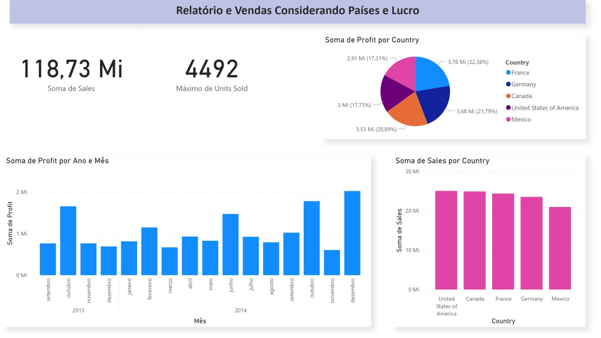

# 📊 Relatório Interativo Power BI

---

### 👤 Autor  
**Adonis Pantoja**

---

### 📂 Estrutura do Repositório  
- `images/` → imagens exportadas dos dashboards, para visualização rápida  
- `pbix/` → arquivo editável do Power BI (se aplicável)  
- `README.md` → capa e descrição do projeto

---

### 📸 Exemplos Visuais

Aqui vão algumas visualizações retiradas dos dashboards:

  

 

---
### 🔗 Acesso ao Relatório Interativo  
Veja o relatório completo e interativo online aqui:  
[Relatório Power BI Interativo](https://adonis071.github.io/relatorio-powerbi/)

### 🛠 Como Utilizar

1. Acesse o relatório interativo pelo link acima.  
2. Use filtros e explore as dashboards para obter insights.  
3. Veja as imagens na pasta `images` para snapshots rápidos ou para uso em apresentações.  
4. Se tiver o arquivo `.pbix`, abra no Power BI Desktop para mais customização.

---

### ⚠ Observações

- O relatório online exige conexão com a internet e permissão pública para visualização.  
- Os dados usados são fictícios ou anonimizados, com foco em aprendizado e demonstração.
